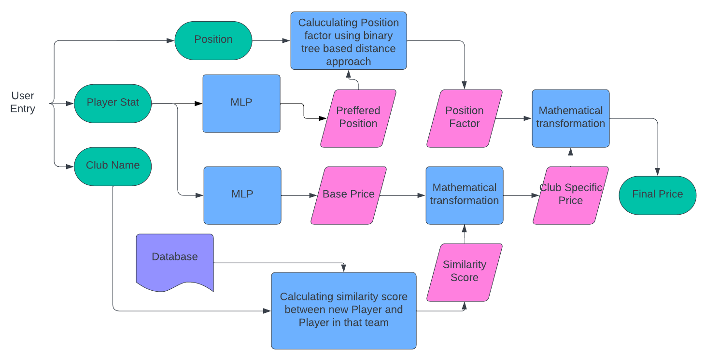

# PlaWorDet-WARP24 - FIFA Player Worth Determination Model

**PlaWorDet-WARP24** is an AI/ML project designed to calculate the value of football players based on a range of metrics, including performance statistics, team chemistry, and positional dynamics. This model is unique in its ability to offer club-specific valuations by considering existing team dynamics, enabling more informed bidding decisions in both in-game and real-life FIFA auctions.

## Objective

The primary goal of this project is to provide an accurate player worth estimation by incorporating the following factors:
1. **Player Statistics**: Detailed analysis of player performance metrics.
2. **Chemistry with Team**: Evaluation of the player’s fit into the current team setup.
3. **Positional Analysis**: Assessment of how well the player matches the team's positional requirements.

## Features

1. **Club-Specific Valuation**: The model calculates a player’s worth relative to the specific club, considering the chemistry with existing players.
2. **Bid Recommendation**: Suggests optimal bidding strategies based on player value and team dynamics.
3. **Interactive Interface**: A user-friendly interface built using Streamlit for easy input and output of player valuations.
4. **Scalability**: The project is designed to work with large football datasets and can be scaled across different leagues and clubs.

### Detailed Pipeline

1. **Input**: The user inputs new player statistics, preferred position, and club name.
2. **Base Price Calculation**: The player's base price is predicted by passing their statistics through an MLP model.
3. **Preferred Position Prediction**: The optimal position for the player is calculated using another MLP model.
4. **Team Similarity Score**: The chemistry score is derived by comparing the new player with existing team members.
5. **Club-Specific Value**: Mathematical transformations are applied to the base price and similarity score to generate a club-specific valuation.
6. **Position Factor**: A binary tree is created where nodes represent positions, and the distance between the preferred and required position is calculated. This is used to adjust the player’s worth.
7. **Final Valuation**: Club-specific value is adjusted based on the position factor to provide the final player worth.

### Flowchart

<div align=center>

</div>

## Installation

1. Clone the repository:
    ```bash
    git clone https://github.com/Laksh-Mendpara/PlaWorDet-WARP24.git
    ```
2. Navigate to the project directory:
    ```bash
    cd PlaWorDet-WARP24
    ```

## Usage

1. **Install Requirements**: Install the necessary dependencies using `requirements.txt`.
    ```bash
    pip install -r requirements.txt
    ```
2. **Running the App**: Start the Streamlit app by running:
    ```bash
    streamlit run Src/app.py
    ```

## Files and Directories

```bash
├── model
│   ├── app2_f1.pth          # Saved model for the player worth prediction
│   ├── best_params.json      # Best model parameters
│   ├── label_encoder.pkl      # Label encoder for categorical data
│   ├── poscalerfin.pkl        # Position scaling model
│   └── pos_model_file.pth     # Position prediction model
├── plots
│   ├── accuracy_plot.png      # Accuracy plot
│   ├── loss_plot.png          # Loss plot
│   ├── pipeline.png           # Pipeline flowchart
│   └── plot_2_f1.png         # Additional plots
├── Src
│   ├── app.py                # Main app file for Streamlit
│   ├── price_predictor.py     # Final inference pipeline
│   ├── analysis.py           # Analyzes the dataset for insights
│   ├── analysis_similarity.py  # Examines price variations with similarity scores
│   ├── FIFA01_merge.py       # Merges datasets from FIFA 17 to FIFA 23
│   ├── position_tree.py       # Constructs a binary tree for positional representation
│   ├── PositionPredictor.py   # Predicts the best preferred position for a player
│   ├── Similarity_Score.py    # Calculates similarity scores between players
│   ├── preprocess_data.py      # Preprocesses input data for the model
│   ├── worthpredictionbasic.py  # Calculates the base price of a player
│   └── __pycache__            # Compiled Python files
```

### File Descriptions

- **`app.py`**: The main application file for running the project using Streamlit, providing a user interface for input and displaying player valuations.
  
- **`analysis.py`**: Contains code for analyzing the dataset, focusing on extracting insights from player statistics.
  
- **`analysis_similarity.py`**: Implements functionality to examine how a player's worth varies with their similarity to existing team members.

- **`FIFA01_merge.py`**: Responsible for merging the datasets from FIFA 17 to FIFA 23 into a comprehensive dataset for analysis.

- **`position_tree.py`**: Constructs a binary tree structure representing player positions, where nodes contain positions with similar characteristics.

- **`PositionPredictor.py`**: Contains the logic for predicting the best position for a player based on their skills and team needs.

- **`price_predictor.py`**: The core inference pipeline that combines all previous steps to determine the final worth of a player.

- **`Similarity_Score.py`**: Calculates the similarity score between the new player and existing players on the team to inform the valuation process.

- **`preprocess_data.py`**: Responsible for preprocessing the raw input data to ensure quality and consistency before it is fed into the model.

- **`worthpredictionbasic.py`**: Contains the code to find the base price of a player based on their statistics using a multi-layer perceptron (MLP).

## Future Scope

1. **Enhanced Data Sources**: Incorporating additional datasets, such as player injuries, transfer history, and external performance metrics, could improve the accuracy of valuations.
2. **Real-Time Analytics**: Developing a live feed that updates player statistics in real-time during games could enhance the model’s utility.
3. **Expansion to Other Sports**: Adapting the model for use in other sports could broaden its application and impact.
4. **User Personalization**: Implementing user-specific recommendations based on their bidding history or team strategies could make the model more effective.

## License

This project is licensed under the MIT License. For more details, see the [LICENSE](LICENSE) file.
